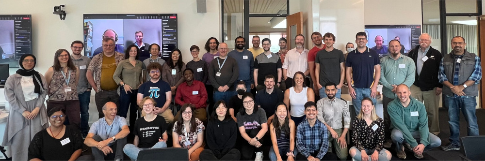

**September 1-3, 2026\
University of Birmingham, UK**

```{r setup, include=FALSE}
knitr::opts_chunk$set(echo = FALSE)
source(file.path("R", "functions.R"))
```

*Collaborate on contributions to base R!*

We are pleased to announce another R Project Sprint, to be hosted at the University of Birmingham, UK, from Tuesday September 1 to Thursday September 3. Novice and experienced contributors are encouraged to apply for a place at the residential event, with funding available for travel (deadline **Friday 8 May**). Read on for more! **#RSprint2026**

{fig-alt="A group photo of participants at R Project Sprint 2023" fig-align="center"}

## About the sprint

R is a popular and widely used software for data science. Like any large open source software project, it takes a lot of work to maintain and develop. Much of the work is done by a small number of volunteers and there is a need to grow the contributor community.

This sprint will bring together novice and experienced contributors, to work alongside members of the R Core Team. Participants will work collaboratively on contributions to base R. The tasks will be prepared in the run-up to the event, but may include:

-   Reviewing, analysing and fixing bugs reported on R's [Bugzilla](https://bugs.r-project.org/).

-   Contributing to message translations via [Weblate](https://translate.rx.studio/projects/r-project/).

-   Work on new developments proposed by core developers.

You can read about the previous edition in 2023 in [this R Journal article](https://journal.r-project.org/news/RJ-2023-3-sprint/).

## Who can take part?

The sprint will involve a mixture of invited and self-nominated participants, so that we have contributors at all experience levels.

The main criteria for participation is a good knowledge of R programming and a keen interest in contributing, as we hope participants continue to contribute after the event. The table below shows the type of knowledge/skills we expect participants to have

| Skills most will have | Skills some will have |
|:------------------------:|:--------------------------------------------:|
| Writing R functions | Programming in C |
| Debugging R functions | Knowledge of S3/S4 classes and methods |
| Writing R help files | Expertise in statistical methods in **stats**, **splines** |
| Using git/Subversion | Able to build R from source |

Other specialist skills e.g. expertise in developing Windows/MacOS GUIs or fluency in language with a low percentage of translated messages on [Weblate](https://translate.rx.studio/projects/r-project/), would of course be welcome!

It will help if you have some experience in contributing to base R, but novice contributors will be mentored in the run-up to the event, so they are prepared.

We are also keen to foster a diverse community of contributors. If you are a member of the [R-Ladies](https://rladies.org/), [rainbowR](https://rainbowr.org/), or [LatinR](https://latin-r.com/) communities, or otherwise identify as part of an underrepresented group among R contributors, then we especially encourage you to self-nominate! To ensure a welcoming environment, we have a code of conduct in place.

## Apply for a place

Anyone interested to attend the sprint is encouraged to self-nominate via the [application form](https://rfoundation.limequery.com/837944?lang=en) by **Friday 8 May**. You will be asked about your experience, skills and background to help us balance participation overall.

Thanks to our [sponsors](#sponsors), meals will be provided for all participants for the duration of the sprint.

Funding is also available to cover participant travel and accommodation in student housing. However if participants are able to fund their travel and accommodation from other sources this will allow more people to attend - companies or other funding bodies providing such support to participants can be acknowledged as sponsors.

## Practicalities

The sprint venue and accommodation details are being finalised, but will be on or very close to the Edgbaston campus of the University of Birmingham.\
\
The Edgbaston campus is 3 miles South-West of Birmingham city centre. It is reachable by train from nearby European countries, or by plane to Birmingham International (BHX) or other UK airports. See the [travel information](https://www.birmingham.ac.uk/contact/directions/getting-here-edgbaston) and [visa](https://www.gov.uk/check-uk-visa) information for international visitors.

As travel funding is available, in-person participation is the default. However a small number of remote participants may be accommodated in exceptional circumstances (e.g. intermediate/advanced contributors with a low chance of a successful visa application). There is space to make a case for remote participation on the application form.

## What's on nearby

Participants may be interested to know of these events happening close to the sprint:

-   7-8 September, [International Research Software Conference](https://www.researchsoft.org/irsc/), Sheffield

-   9-11 September, [RSECon26](https://rsecon26.society-rse.org/), Sheffield

-   7-10 September, [RSS International Conference](https://rss.org.uk/training-events/conference2026/), Bournemouth

31 August is a bank holiday in the UK, there are typically many festivals, fairs and other events over the long weekend at the end of the school summer holidays.

## Local organizing team

::::: people-gallery
::: {#person1}
```{r, results = "asis"}
person_info(name = "Heather Turner",
            affiliation = "Principal RSE<br>R Core Developer",
            pic = "media/heather_turner.jpg",
            alt = "Headshot of Heather Turner smiling for the camera. She is a middle-aged white woman with dark, shoulder-length straight hair and wears glasses.",
            website = "https://www.heatherturner.net/",
            email = "h.l.turner@bham.ac.uk")
```
:::

::: {#person2}
```{r, results = "asis"}
person_info(name = "Ella Kaye",
            affiliation = "Research Software Engineer",
            pic = "media/ella_profile.jpg",
            alt = "Headshot of Ella outside in the sun, smiling, looking slightly off-camera. She is a white woman in her 40s with short dark hair.",
            website = "https://ellakaye.co.uk",
            email = "e.kaye.1@bham.ac.uk")
```
:::
:::::

We are coordinating with the [R Contribution Working Group](https://contributor.r-project.org/working-group) and the R Core Team.

## Contact

For queries about this event, please contact [h.l.turner\@bham.ac.uk](mailto:h.l.turner@bham.ac.uk).

## Sponsors {#sponsors}

### Core funding

Providing sponsorship for general participant travel and accommodation, plus venue and catering costs\

[{fig-alt="R Consortium logo" fig-align="left" width="300"}](https://www.r-consortium.org)

### Platinum sponsors

Providing sponsorship for R Core travel.

::: flex-container
[The R Foundation](https://www.r-project.org/foundation/)
:::

Further sponsors welcome to support participant travel, accommodation and/or social events. Sponsors will be acknowledged on this website, on the R Contributors [Mastodon](https://hachyderm.io/@R_Contributors) account, and in reports of the sprint. Please contact [h.l.turner\@bham.ac.uk](mailto:h.l.turner@bham.ac.uk) to discuss!
